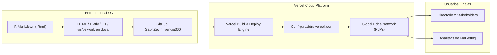

# INFORME TÉCNICO DE DESPLIEGUE Y PUBLICACIÓN WEB
## Proyecto: Influencia 360 — Business Intelligence y Redes Bayesianas

---

### Datos Generales del Proyecto
* **Autor / Desplegador:** SabriZel
* **Plataforma de Alojamiento Seleccionada:** [Vercel](https://vercel.com/)
* **Repositorio en GitHub:** [github.com/SabriZel/Influencia360](https://github.com/SabriZel/Influencia360)
* **URL de Producción en Vercel:** [https://influencia360.vercel.app](https://influencia360.vercel.app)
* **Reportes Publicados y Verificados (HTTP 200 OK):**
  1. **Informe Metodológico y Hub Central:** [https://influencia360.vercel.app/](https://influencia360.vercel.app/)
  2. **Reporte 1 (Exploración de Datos Iniciales):** [https://influencia360.vercel.app/dashboard_datos.html](https://influencia360.vercel.app/dashboard_datos.html)
  3. **Reporte 2 (Ranking, Red Bayesiana e Inferencias):** [https://influencia360.vercel.app/dashboard_resultados.html](https://influencia360.vercel.app/dashboard_resultados.html)

---

## 1. Características Básicas de la Publicación en el Servicio Elegido (Vercel)

El despliegue de **Influencia 360** en Vercel se fundamenta en el paradigma moderno de arquitectura web desacoplada (**Jamstack**) para la distribución de reportes de Business Intelligence:



1. **Arquitectura Estática Autónoma (Static Generation):**
   Los reportes fueron generados a partir de R Markdown combinando librerías interactivas de JavaScript (`Plotly.js`, `visNetwork`, `DataTables`). Vercel sirve estos activos directamente desde el directorio `docs` mediante una configuración declarativa en [`vercel.json`](file:///C:/Users/sabri/.gemini/antigravity/scratch/Influencers/vercel.json):
   ```json
   {
     "outputDirectory": "docs",
     "cleanUrls": false
   }
   ```
   No requiere un servidor de aplicaciones en tiempo de ejecución (Node.js/PHP/R), lo que elimina puntos de falla del backend y reduce los tiempos de respuesta al mínimo teórico de la red.

2. **Red Global de Entrega en el Borde (Global Edge Network):**
   Vercel replica los archivos en una red CDN multi-nube con más de 100 puntos de presencia (PoPs) a nivel mundial. Las solicitudes de los usuarios son enrutadas al nodo geográficamente más cercano, permitiendo que archivos interactivos de más de 10 MB se descarguen con alta velocidad y baja latencia.

3. **Seguridad y Cifrado HTTPS Automatizado:**
   Cada despliegue cuenta automáticamente con un certificado TLS/SSL emitido y gestionado mediante Let's Encrypt con renovación desatendida, garantizando tráfico cifrado de extremo a extremo sin intervención manual.

4. **Despliegues Atómicos e Inmutables (Zero-Downtime e Instant Rollback):**
   Cada comando de despliegue genera una compilación inmutable con un identificador único (ejemplo: `dpl_EzdHn3yqn78jz9DH4WTqVhaZ6L18`). Los cambios no sobrescriben archivos en caliente; el alias `influencia360.vercel.app` se conmuta de forma instantánea únicamente cuando la nueva versión está totalmente validada, permitiendo revertir a cualquier versión anterior en un solo clic si se detecta un error.

5. **Compresión HTTP de Alto Rendimiento:**
   Vercel aplica compresión nativa **Brotli** y **Gzip** al vuelo. Para reportes de BI intensivos en datos tabulares y JSON, esto reduce el tamaño de transferencia por red hasta en un 75% respecto al tamaño original en disco.

---

## 2. Solución a Necesidades Específicas de Distribución y Operación

### 2.1. Tener una dirección de internet cualquiera para distribuir los reportes
* **¿Es la solución por defecto?:** **Sí, absolutamente.**
* **Mecanismo:** 
  Al crear un proyecto en Vercel, la plataforma genera automáticamente un subdominio bajo la zona pública `*.vercel.app` (por ejemplo, `influencia360-6d6671mqh-sabri19.vercel.app` y el alias de producción `influencia360.vercel.app`).
* **Ventajas operativas:**
  * Disponibilidad inmediata sin necesidad de adquirir ni configurar un dominio comercial.
  * Se puede personalizar el prefijo del subdominio de forma gratuita en el panel (*Project Settings > Domains*), siempre que el nombre esté disponible.
  * Permite distribuir los enlaces a clientes, profesores o evaluadores inmediatamente tras el despliegue.

---

### 2.2. Tener una dirección de internet específica o de la empresa para distribuir los reportes
Para que los reportes respondan bajo la marca corporativa de la organización (ejemplo: `reportes.miempresa.com` o `influencia360.com`):

* **Opciones Internas (En Vercel):**
  1. En el panel de control del proyecto, ingresar a **Settings > Domains**.
  2. Escribir el dominio o subdominio deseado y hacer clic en **Add**.
  3. Vercel analiza automáticamente la configuración y provee los registros DNS exactos que deben crearse. Una vez propagado el DNS, Vercel aprovisiona y renueva el certificado SSL automáticamente sin costo.

* **Opciones Externas (En el proveedor DNS corporativo como Cloudflare, AWS Route 53, GoDaddy):**
  * **Para un subdominio** (`reportes.miempresa.com`):
    Crear un registro **`CNAME`** que apunte a `cname.vercel-dns.com`.
  * **Para un dominio raíz / apex** (`miempresa.com`):
    Crear un registro **`A`** que apunte a la IP de encaminamiento Anycast de Vercel: `76.76.21.21` (o un registro `ALIAS` / `ANAME` apuntando a `cname.vercel-dns.com` si el DNS lo admite).
  * **Delegación de Nameservers:**
    También es posible delegar la zona completa apuntando los NS del dominio a `ns1.vercel-dns.com` y `ns2.vercel-dns.com` para que Vercel administre todos los registros de forma integrada.

---

### 2.3. Tener mucho volumen de información para desplegar
* **¿Es un problema o tema que involucra a estos servicios?:**
  **Sí, es un aspecto crítico de arquitectura que involucra tanto límites de la plataforma como restricciones de rendimiento del navegador.**

* **Diagnóstico del proyecto actual:**
  * Cada dashboard generado por R Markdown (`dashboard_datos.html` y `dashboard_resultados.html`) pesa aproximadamente **10 MB**, ya que incrusta las observaciones, metadatos y librerías completas en un solo archivo autosuficiente (total desplegado: ~30.3 MB).
  * Vercel admite archivos estáticos individuales de hasta 100 MB y despliegues completos de varios gigabytes. Por ende, para el tamaño actual el despliegue funciona con normalidad.

* **¿Cuándo se convierte en un problema?**
  1. **Consumo de Ancho de Banda (Bandwidth Quota):** La capa gratuita de Vercel contempla 100 GB/mes. Si 10,000 usuarios consultan un dashboard de 10 MB, se consumen 100 GB en poco tiempo, bloqueando el sitio o requiriendo salto a planes de pago.
  2. **Colapso del Navegador del Cliente (Client RAM & DOM limits):** Los navegadores móviles o equipos con recursos limitados se congelan al procesar dataframes con más de 100,000 registros y nodos en memoria interactiva (`visNetwork` y `DT`).
  3. **Tiempos de Compilación (Build Timeouts):** Si se procesan millones de registros brutos dentro del CI/CD de la plataforma, el proceso de compilación en R superará los límites de tiempo de ejecución de las máquinas de build (Serverless Build Timeout).

* **Estrategias de solución (Internas y Externas):**
  * **Agregación Analítica Previa en R (Solución Interna en el Pipeline):** Nunca exportar microdatos de transacciones individuales a la visualización. Utilizar `dplyr` en R para computar resúmenes, cuantiles, matrices agregadas y rankings antes de inyectar los datos en los chunks de R Markdown.
  * **Arquitectura Desacoplada de Datos (Client-side Data Fetching):** Separar el HTML ligero de los datos pesados. Guardar los datos en formato Parquet o JSON en un almacenamiento de objetos externo (Cloudflare R2, AWS S3 o Supabase) y cargarlos dinámicamente mediante peticiones `fetch()` asíncronas con paginación en el servidor según la interacción del usuario.
  * **CDN Frontal con Caché Agresivo (Solución Externa):** Colocar Cloudflare delante del dominio para cachear los activos estáticos y evitar que cada petición compute contra la cuota de transferencia de Vercel.

---

### 2.4. Publicar información para usuarios específicos o con credenciales
* **¿Es un tema que se maneja con estos servicios?:**
  **Sí, se maneja de forma profesional mediante capas de autenticación nativas y externas.**

* **Opciones Internas de Vercel:**
  1. **Vercel Edge Middleware:**
     Se puede agregar un script en el Edge (en TypeScript/JavaScript) que intercepte toda petición dirigida a `/dashboard_resultados.html` antes de que el CDN entregue el archivo. El middleware evalúa:
     * Si existe una cabecera de autenticación básica (`HTTP Basic Auth`).
     * Si existe una cookie con un token JWT válido.
     Si el usuario no está autenticado, el Edge lo redirige a una pantalla de inicio de sesión o devuelve un código `401 Unauthorized`.
  2. **Deployment Protection / Password Protection (Nativo de Vercel):**
     Vercel permite activar protección global por contraseña o restringir el acceso exclusivamente a miembros autenticados del equipo de Vercel.

* **Opciones Externas:**
  * **Cloudflare Zero Trust / Cloudflare Access (Recomendado para entornos corporativos):**
    Permite colocar un proxy de seguridad delante de `https://influencia360.vercel.app` sin modificar una sola línea de código del proyecto. Cuando un usuario intenta acceder, Cloudflare solicita inicio de sesión mediante Google Workspace corporativo, Microsoft Entra ID o códigos OTP enviados al correo del empleado.
  * **Plataformas de Autenticación Especializadas:**
    Integración con proveedores como Auth0, Clerk o Firebase Auth para construir un portal de acceso con control de roles (RBAC).

---

### 2.5. Dos Características Avanzadas en Cuentas de Pago (Pro/Enterprise) y su Uso en Influencia 360

#### Característica 1: Single Sign-On Corporativo (SAML SSO) y Password Protection a Nivel de Proyecto
* **Descripción:**
  Las cuentas de pago (Vercel Pro y Enterprise) desbloquean la capacidad de exigir inicio de sesión mediante el proveedor de identidad institucional de la empresa (Okta, Microsoft Azure AD / Entra ID, Ping Identity) o fijar contraseñas globales independientes por ambiente (Producción / Preview).
* **Cómo lo utilizaríamos en Influencia 360:**
  Los reportes de este proyecto contienen métricas de Business Intelligence, rankings de reputación y probabilidades condicionales bayesianas con valor estratégico y confidencial para la compañía. Utilizaríamos **SAML SSO** para que el acceso a `https://influencia360.vercel.app/dashboard_resultados.html` esté restringido estrictamente a los directores de marketing y analistas con correo corporativo activo, asegurando que ante la desvinculación de un empleado, su acceso a los reportes analíticos quede revocado automáticamente.

#### Característica 2: Entornos de Preview Colaborativos con Anotaciones Visuales en Pantalla (Visual Comments & Deployment Previews)
* **Descripción:**
  En planes de pago, cada Pull Request o rama de Git genera una URL de previsualización aislada equipada con la barra de herramientas **Vercel Toolbar**. Esta herramienta permite a los miembros del equipo dejar comentarios visuales, capturas y notas ancladas directamente sobre los elementos gráficos de la página (similar a la experiencia de Figma o Google Docs).
* **Cómo lo utilizaríamos en Influencia 360:**
  Cuando el equipo de Ciencia de Datos modifique la estructura de la red bayesiana o reajuste la semilla de simulación en una rama de Git (`git push origin feature/nueva-red`), Vercel compila un preview temporal. Los líderes de negocio y directores pueden interactuar con el grafo de la red (`visNetwork`) y dejar anotaciones directamente sobre nodos específicos (ejemplo: *"revisar la probabilidad a posteriori para el nodo de seguidores"*). Una vez resueltas las observaciones en la misma interfaz, se autoriza el merge a producción con total trazabilidad.

---

### 3. Conclusiones y Resumen de URLs Activas

| Componente | Servicio | URL de Acceso | Estado |
| :--- | :--- | :--- | :--- |
| **Repositorio Código Fuente** | GitHub | [github.com/SabriZel/Influencia360](https://github.com/SabriZel/Influencia360) | Sincronizado |
| **Portal Central / Ejecutivo** | Vercel | [influencia360.vercel.app](https://influencia360.vercel.app/) | Activo (HTTP 200) |
| **Reporte 1: Exploración de Datos** | Vercel | [influencia360.vercel.app/dashboard_datos.html](https://influencia360.vercel.app/dashboard_datos.html) | Activo (HTTP 200) |
| **Reporte 2: Modelado Bayesiano** | Vercel | [influencia360.vercel.app/dashboard_resultados.html](https://influencia360.vercel.app/dashboard_resultados.html) | Activo (HTTP 200) |
| **Espejo Secundario** | GitHub Pages | [sabrizel.github.io/Influencia360](https://sabrizel.github.io/Influencia360/) | Activo (HTTP 200) |
